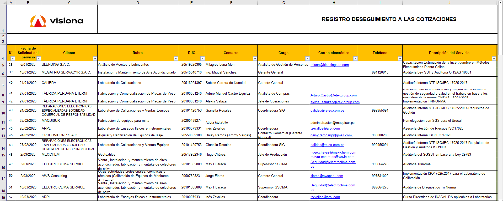
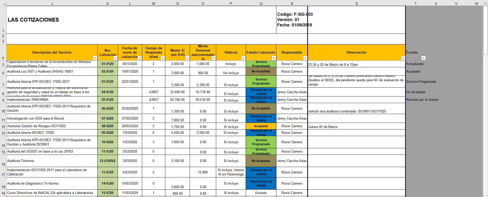

# Proceso Cotización

El documento presente busca describir el proceso actual por el cual la empresa realiza las cotizaciónes, desde el contacto con el cliente hasta el envío, recepción de la respuesta y gestión de cotizaciones. Se utilizará la información recopilada en la entrevista, así como observaciones directas y análisis de documentos usados actualmente.

## Descripción General

El proceso de cotización en Visiona, actualmente, tiene un carácter informal dentro de la propia empresa. Esto debido a que no existe un estándar, se basa en suposiciones de los propios empleados que usan como ejemplos cotizaciones similares pasadas, calculan costos de acuerdo a sus criterios propios y no tiene guías establecidas de qué considerar en este documento. Todo lo antes mencionado, junto con la gran cantidad de variables que deben tomar en cuenta al momento de preparar una cotización, generan un grave problema dentro de la empresa: Demoras para la preparación y entregas de cotizaciones; demorando incluso hasta 4 días para responder y enviar el documento a un posible cliente.

## Análisis de Documentos y Herramientas

Actualmente, Visiona cuenta con los siguientes documentos y herramientas para realizar cotizaciones:

### **1. Plantilla Cotización** 

Documento Word en el cual llenan los datos necesarios de acuerdo al cliente, tipo de servicio, cronograma y costos del servicio. Debido a la gran variedad de servicios, esta plantilla no es única; así que puede incluir distintas secciones. Para completar esta plantilla, no se tiene una base de datos de clientes o servicios, los encargados de la cotización copian y pegan datos, secciones o información de cotizaciones previas similares, tomando mucho más tiempo del requerido. Una plantilla de cotización para un servicio de auditoría se puede consultar en: [Plantilla Cotización Auditoria](files/plantilla_cotizacion_auditoria.pdf)

### **2. Excel de Cotizaciones Historico**

Libro de Excel en el que se guardan todas las cotizaciones realizadas, separadas por año. Cada hoja del libro contiene un año diferente, en el cual están registrados cada cotización con los datos respectivos; sim embargo, la tabla usada cada año varía, no hay validación de tipos de datos, fechas, precios, nombres, etc. Esta información sirve únicamente para tener un registro histórico y para copiar datos de cliente, no siento útil como base de datos integrada que permita rellenar la plantilla más velozmente. A continuación dos imagenes correspondientes a las cotizaciones del año 2020: [^1] 

   

Registro histórico cotizaciones 1  

  

Registro histórico cotizaciones 2

## Diagrama de Proceso (AS IS)

[^1]: Buscando no exponer datos actuales se decidió usar datos históricos de hace 6 años
