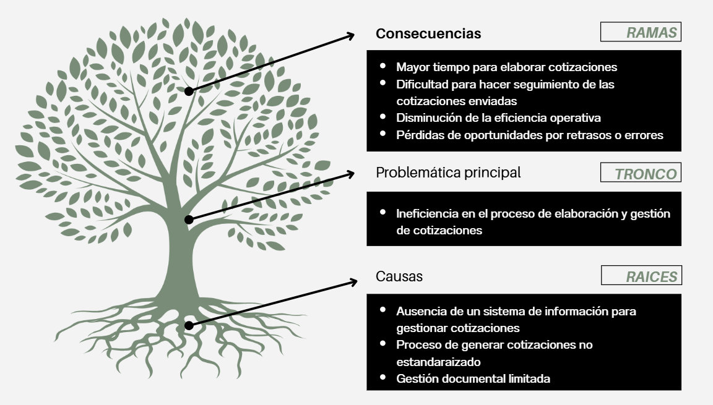

# Análisis Causa Efecto

El presente documento tiene como objetivo exponer el principal problema dentro del proceso de realización de cotizaciones y realizar un análisis de las causas principales y los efectos que ocasiona en el trabajo diario de los empleados.

## Problemática

Luego de revisar y analizar la información obtenida tanto de la entrevista con los empleados de la empresa, como de la observación del proceso y recopilación de herramientas usadas; se obtiene que el principal problema dentro del proceso de cotización en Visiona es: :

``` text
Ineficiencia en el proceso de elaboración y gestión de cotizaciones.
```

Esto queda en evidencia debido al largo tiempo que se toman los empleados en realizar una cotización desde el recibimiento de solicitud de un cliente, hasta el envío del documento.

Este problema se detallará más en la siguiente sección.

## Árbol de Problemas

He decidido usar este gráfico para visualizar de mejor manera las causas y efectos relacionados con el problema de .A continuación el gráfico:  

  

### Causas

1. **Ausencia de un sistema de información para gestionar cotizaciones:** Esta es la principal causa de que el trabajo se realice de forma manual, no se cuenta con una base de datos centralziada que permita gestionar, clientes, servicios, tipos de servicios, cotizaciones antiguas y demás información relevante. Toda la información se encuentra en archivos dispersos y sin un orden completamente establecido.

2. **Procesos poco estandarizados:** El flujo de trabajo para elaborar una cotización no está bien definido. Si bien se realizó un diagrama de proceso para representar el orden de las actividades para generar una cotización; esto no contempla el trabajo individual que realiza cada trabajador diferente en cada actividad del gráfico. Cada colaborador calcula presupuestos a su manera y sin estándares claros

3. **Gestión documental limitada:** Si bien todos los documentos de cotizaciones pasadas se encuentran en el repositorio Mega, estos son difíciles de consultar. Estos están ordenandos por cliente, luego por año y finalmente por el servicio; por lo mismo, un trabajador debe recordar cuándo y a quién se le dió un serivicio similar, solo para encontrar los datos respectivos.

### Efectos 

1. **Mayor tiempo para elaborar cotizaciones:** El principal efecto negativo, pues debido a los diversos criterios que se deben tomar en cuenta para hacer una cotización, el desarrollo de estas puede tomar más de dos días (otros factores del tiempo tan extenso es debido a la carga operativa de los trabajadores que también deben continuar con las labores de los proyectos).

2. **Dificultad para hacer seguimiento de las cotizaciones enviadas:** El seguimiento es totalmente manual, por lo que se basa únicamente en la memoria de los trabajadores para saber qué cotizaciones requierenr respuesta o modificaciones.

3. **Disminuación de la enficiencia operativa:** La extensa labor en la elaboración de cotizaciones genera que se gaste más tiempo en este proceso y mucho menos en labores operativas relacionadas directamente con los servicios.

4. **Pérdidas por retrasos o errores:** El tiempo extenso de respuesta puede ocasionar que los posibles clientes pierdán interés o encuentren una mejor oferta en menor tiempo.