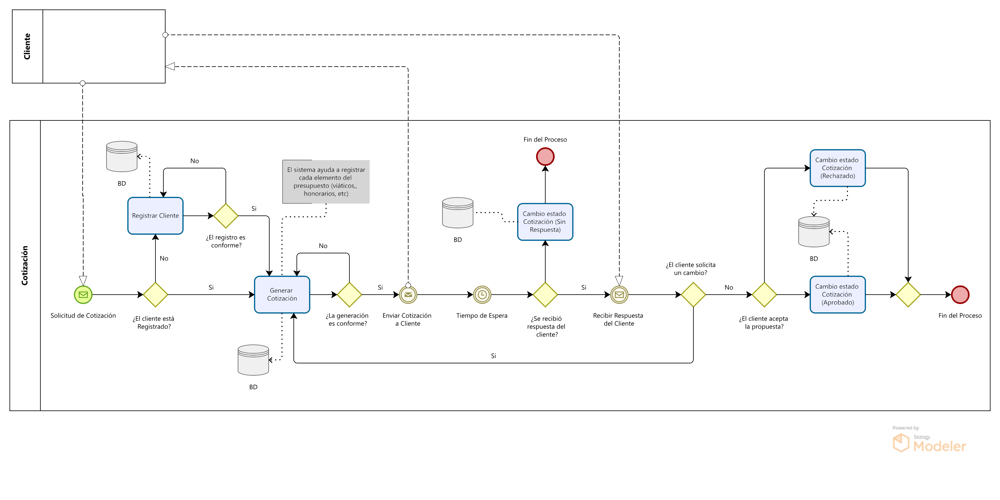

# Solución Propuesta

El presente documento tiene como objetivo documentar la solución propuesta para la mejora del proceso de cotización mediante un sistema de información que permita centralizar la información relevante. Se realizará también un diagrama de proceso para este nuevo proceso.

## Análisis de alternativas

A continuación se presenta una tabla de las alternativas posibles que buscan solucionar el problema identificado, incluyendo ventajas y desventajas:

| Alternativa | Descripción | Ventajas | Desventajas |
| --- | --- |--- |---|
| **A1. Mantener proceso manual, optimizando plantillas** | Estandarizar las cotizaciones mediante plantillas en Microsoft Word o Excel y establecer un procedimiento interno para su elaboración y seguimiento.| Muy bajo costo, implementación inmediata, no requiere capacitación técnica.| Continúa dependiendo del trabajo manual, mayor probabilidad de errores, no centraliza la información ni facilita seguimiento.|
| **A2. Plataforma de gestión comercial existente (CRM)** | Implementar una herramienta comercial en la nube que incluya módulos para clientes, oportunidades y cotizaciones. | Implementación rápida, funcionalidades ya desarrolladas, soporte del proveedor. | Costos de suscripción, funcionalidades innecesarias para la empresa, limitada personalización y dependencia de un tercero.|
| **A3. Aplicación de escritorio con base de datos local**| Crear un sistema instalado en los equipos de la empresa con una base de datos compartida dentro de la red local.| No depende de Internet para su funcionamiento interno, mayor control sobre los datos.| Requiere que los usuarios trabajen desde la oficina, dificulta el acceso remoto, el mantenimiento y las copias de seguridad son más complejos. |
| **A4. Sistema web de cotizaciones con servidor web** | Desarrollar un sistema web centralizado, alojado en un servidor web, que permita gestionar clientes, servicios y cotizaciones mediante una base de datos única, accesible desde cualquier equipo autorizado con conexión a Internet. | Información centralizada, acceso remoto, seguimiento de cotizaciones en tiempo real, mayor escalabilidad, facilidad de mantenimiento y respaldo de la información. | Puede requerir una inversión inicial en desarrollo y alojamiento web, además de depender de una conexión a Internet para su funcionamiento.|

## Selección de la Solución

Tras analizar las alternativas propuestas, se selecciona 

``` text
Sistema web de cotizaciones con servidor web
```

Esto debido a que ofrece la mejor relación entre funcionalidad, accesibilidad y escalabilidad para las necesidades de Visiona. Esta solución permitirá centralizar la información, automatizar el proceso de elaboración y seguimiento de cotizaciones, reducir errores derivados de la gestión manual y facilitar el acceso al sistema desde cualquier ubicación autorizada.

## Diagrama de Proceso (TO BE)

  

A continuación, la descripción de cada parte del proceso:

1. El proceso empieza cuando un cliente solicita una cotización; esta comunicación se da mediante el correo electrónico de la empresa, el número de teléfono empresarial u otro medio de comunicación alternativo.
2. Una vez recibida la solicitud, el encargado de realizar la cotización, verifica si el cliente para el cual se realizará el documento se encuentra registrado o no dentro del sistema. De no estarlo, lo registra con sus datos más relevantes (correo electrónico, persona de contacto, número de teléfono, RUC, etc).
3. Luego se procede a generar la cotización, en una pestaña, se encuentran todos los bloques a tener en cuenta al momento de generar una cotización, viáticos, costo de servicio, descuentos y demás. Cada bloque puede incluirse o no de ser necesario para el servicio específico. El encargado procede a rellenar cada bloque y procede a generar el documento PDF de la cotización.
4. El sistema envía la cotización al correo correspondiente y se espera a recibir una respuesta.
5. De no tener respuesta se cambia el estado de la cotización a: **Sin Respuesta**, y se cierra el proceso.
6. Si el cliente solicita una reevaluación o una modificación en el serivicio y la cotización, se procede a realziarla, modificando los bloques necesarios, enviando la nueva versión por correo.
7. Si el cliente no acepta la propuesta, se cambia el estado de cotización a: **Rechazada**.
8. Si el cliente acepta la propuesta, se cambia el estado de cotización a: **Aceptada**.